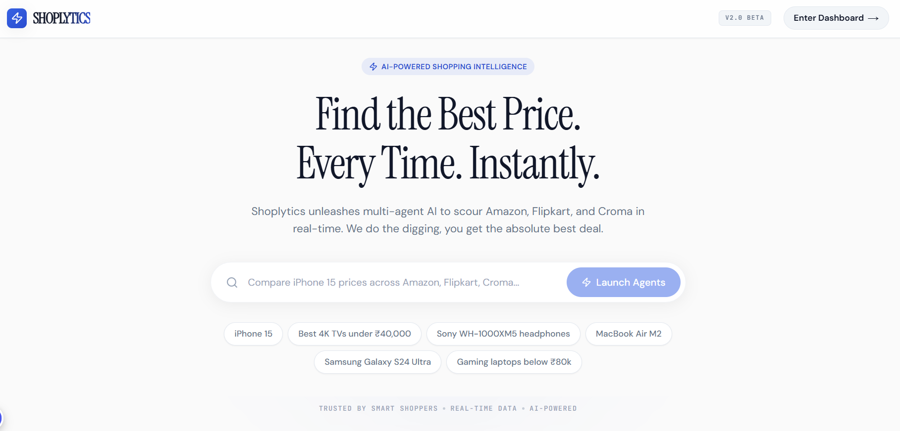
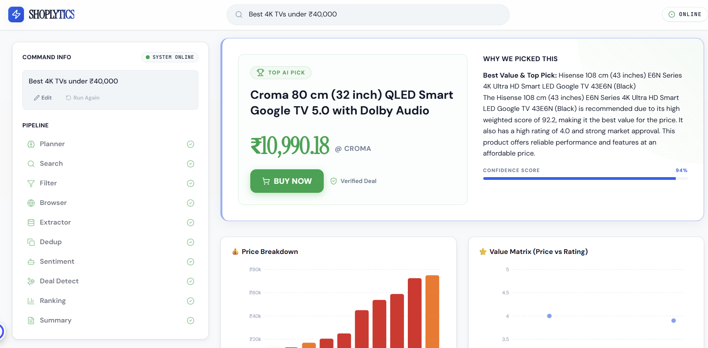
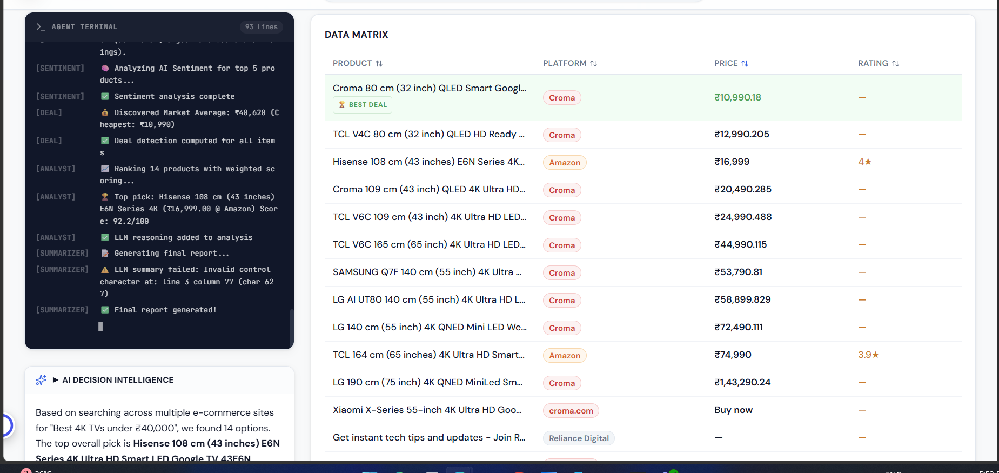

# ⚡ Shoplytics
**AI-Powered Product Intelligence & Smart Shopping Copilot**

Shoplytics is a cutting-edge, multi-agent AI system that autonomously searches, scrapes, analyzes, and compares products across multiple e-commerce platforms. 

By unifying browser automation with intelligent AI agents, Shoplytics operates as an expert shopping assistant—acting exactly like a human researcher, but at machine speed. 

It provides real-time product comparisons, deep sentiment analysis, active deal detection, and explainable AI-powered recommendations.

---

## 📸 Demo


*The clean, premium Shoplytics interface.*


*Visualizing the AI's weighted decision scoring and reasoning.*


*The structured, clickable product catalog.*

---

## ✨ Key Features
- **🤖 Multi-Agent AI Pipeline**: A specialized network of AI agents collaborating intelligently to retrieve and process data.
- **🌐 Real-Time Product Scraping**: Navigates modern JS-heavy e-commerce frameworks via Playwright stealth rendering.
- **🧬 Semantic Deduplication**: Prevents duplicate listings by comparing product specs, titles, and SKUs across retailers.
- **📈 AI-Based Ranking System**: Scores products objectively on a 0-100 scale using Price, Rating, Brand reputation, and Seller trust.
- **⚖️ Deal Detection Engine**: Flags historical price anomalies, mapping "Best Value" and "Overpriced" tags dynamically.
- **🧠 Sentiment Analysis**: Summarizes hundreds of customer reviews into a single Positivity Score and Sentiment Badge.
- **📊 Interactive Dashboard**: A premium, glassmorphism-themed Streamlit UI featuring Plotly visualizations and transparent AI reasoning.

---

## 🏗️ Architecture Overview

Shoplytics utilizes a modular Graph execution system (LangGraph). The workflow is divided specialized domains, each managed by an expert Agent:

1. **Planner**: Analyzes the user's natural language query and formulates a step-by-step execution graph.
2. **Search**: Queries major search engines (Google/DuckDuckGo) to discover relevant e-commerce listings for the target product.
3. **Domain Filter**: Cleans the search results, ensuring only trusted retailers (Amazon, Flipkart, Croma, etc.) proceed.
4. **Browser (Playwright)**: A stealth-enabled automated browser that navigates to the trusted URLs and extracts raw HTML snapshots.
5. **Extractor**: Converts raw HTML into structured `ExtractedProduct` schemas. Uses lightning-fast CSS for known domains, and falls back to LLM-extraction for unknown sites.
6. **Deduplicator**: Merges identical products from the same stores to ensure clean data representation.
7. **Sentiment Analyzer**: Reads on-page reviews and applies an LLM to generate sentiment metrics (Positive vs Negative percentages).
8. **Deal Detection**: Compares parsed prices against historical/market averages to identify true financial value.
9. **Ranking (Analyst)**: Ranks all gathered products using a deterministic weighted algorithm and extracts AI Reasoning for the Top Pick.
10. **Summary**: Formats the final mathematical and qualitative insights into the dashboard format.

---

## ⚙️ Tech Stack
- **Python 3.10+**: Core backend logic.
- **Streamlit**: Beautiful, reactive frontend UI.
- **Playwright**: Headless stealth browser automation.
- **LangGraph**: Stateful multi-agent orchestration.
- **LLMs**: Agnostic support for Groq (Llama-3), OpenAI, or Google Gemini.
- **Asyncio**: Highly concurrent HTTP networking and parsing.
- **Plotly**: Interactive data visualization.

---

## 🚦 How It Works

1. **User Query**: You ask for a product (e.g., *"Compare iPhone 15 prices"*).
2. **Planning**: The AI creates a sub-task blueprint.
3. **Search**: Search engines return the top retail URLs.
4. **Scraping**: Playwright spins up, rendering the pages asynchronously.
5. **Extraction**: CSS/LLMs parse names, prices, schemas, and links.
6. **Deduplication**: Redundant listings are aggressively filtered.
7. **Analysis**: Sentiments are formed, and deals are weighed.
8. **Ranking**: The Analyst agent grades every item out of 100.
9. **Recommendation**: The absolute best product is isolated, and natural language reasoning is drafted to explain *why*.
10. **UI Display**: The results populate the Shoplytics table and AI Decision matrices.

---

## 🖥️ UI Overview
The Streamlit dashboard brings the data to life through three main panes:

- **Command Input**: The unified search bar and dynamic execution pipeline tracking.
- **AI Decision Intelligence**: The center dashboard. Exposes *why* the AI chose the winner, displaying a Plotly breakdown of the Trust/Price/Rating score metrics and bulleted reasoning.
- **Market Intelligence Table**: The complete Pandas-rendered product catalog. Features interactive UI columns, badge indicators, and clickable product titles to jump straight to the checkout page.

---

## 🚀 Installation & Setup

1. **Clone the repository:**
   ```bash
   git clone https://github.com/tanveerbedi/shoplytics.git
   cd shoplytics
   ```

2. **Install dependencies:**
   ```bash
   pip install -r requirements.txt
   playwright install chromium
   ```

3. **Set your Environment Variables:**
   Create a `.env` file and add your preferred LLM API keys:
   ```env
   GROQ_API_KEY=your_key_here
   GOOGLE_API_KEY=your_key_here
   ```

4. **Run the Backend API:**
   ```bash
   uvicorn main:app --reload --port 8000
   ```

5. **Launch the Dashboard (In a new terminal):**
   ```bash
   streamlit run streamlit_app.py --server.port 8501
   ```

---

## 🎮 Usage Instructions

Enter natural language queries into the UI just as you would talk to a friend:

- *"Find best laptop under ₹80,000 for college"*
- *"Cheapest 4K TV under ₹40,000"*
- *"Compare iPhone 15 prices across stores"*
- *"What's the best Sony noise-cancelling headphone deal right now?"*

---

## 📁 Folder Structure

```text
Shoplytics/
├── agents/            # The Multi-Agent logic (Planner, Extractor, Analyst, etc)
├── extractors/        # Site-Specific Regex/CSS Parsing rules
├── models/            # Pydantic Schemas locking inter-agent data flow
├── utils/             # LLM initializers and text cleaning scripts
├── orchestrator/      # LangGraph state management and execution routing
├── streamlit_app.py   # The visual dashboard
├── main.py            # FastAPI entry point
└── requirements.txt
```

---

## 🔮 Future Improvements
- **Price History Tracking**: Implementing a chron-job database to track product pricing over months to identify true discounts.
- **Voice Assistant**: Adding Whisper API to allow for conversational shopping.
- **Personalized Recommendations**: User profiles that remember brand preferences and target budgets.
- **Mobile UI**: A React Native wrapper for on-the-go deal hunting.

---

## 🌟 Why This Project Is Unique
Most scrapers are dumb, deterministic scripts. **Shoplytics** is different.

- **Multi-Agent Architecture**: It delegates tasks just like a human company delegates to departments.
- **Real-Time Web Interaction**: It doesn't rely on stale APIs; it navigates the live web using advanced stealth browsers.
- **AI Reasoning**: It doesn't just show you data; it *argues* its case, explaining mathematically why Product A beats Product B.
- **Decision Intelligence**: Transparent, trustworthy AI recommendations you can verify instantly via clickable links.

---

## 📄 License
This project is licensed under the MIT License - see the [LICENSE](LICENSE) file for details.
