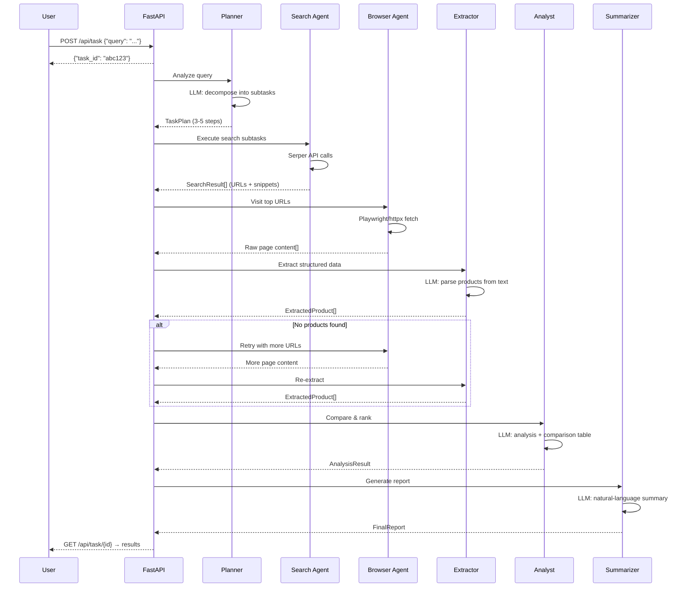
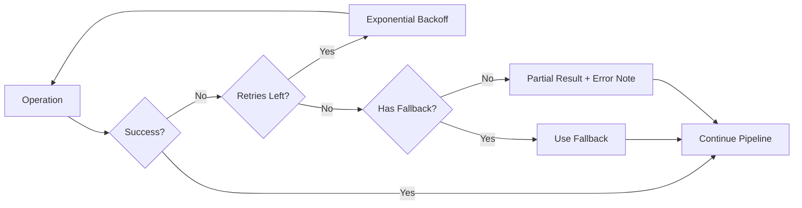

# Architecture Deep-Dive

## Agent Interaction Flow



---

## Prompt Templates

### Planner Prompt
```
You are a planning agent for an autonomous web research system.
Given a user's task, create a step-by-step execution plan.

Available tools: search, browse, extract, analyze

Rules:
1. Limit to 3-5 steps maximum
2. Start with search steps
3. End with an analyze step
4. Be specific about what data to extract

User's task: {query}
→ Outputs JSON: TaskPlan
```

### Extraction Prompt
```
Extract ALL relevant products/items from this webpage text.
Provide: name, price (numeric + display), currency, rating, specs, source.

Rules:
1. Only extract EXPLICITLY stated data (no guessing)
2. Null for unavailable fields
3. Return empty list if no products found

Webpage text: {content}
→ Outputs JSON: ExtractedProduct[]
```

### Analysis Prompt
```
Rank products by value-for-money, features, and ratings.
Create a Markdown comparison table.
Select best pick with reasoning.

Products: {products_json}
Original query: {query}
→ Outputs JSON: AnalysisResult
```

---

## Monitoring Dashboard Design

The Streamlit dashboard provides:

| Panel | Content |
|-------|---------|
| **Agent Activity Log** | Real-time stream of emoji-tagged messages from each agent |
| **Status Badge** | Visual pending → running → completed/failed status |
| **Comparison Table** | Markdown table of ranked products |
| **Recommendation Card** | Highlighted best-pick with reasoning |
| **Raw Data Expander** | Collapsible view of all extracted products |

### WebSocket Protocol

Messages sent over `ws://localhost:8000/ws/task/{id}`:

```json
{"type": "message", "agent": "search", "content": "🔍 Searching...", "level": "info"}
{"type": "status", "status": "running"}
{"type": "result", "data": {"summary": "...", "comparison_table": "...", ...}}
```

---

## Error Handling Philosophy



**Key principle:** Never completely fail. Always return *something* useful, even if partial.

---

## Performance Considerations

| Area | Optimization |
|------|-------------|
| **Search** | Parallel Serper calls for multiple subtasks |
| **Browsing** | Configurable `MAX_BROWSER_PAGES` to limit concurrent Playwright instances |
| **Extraction** | Text truncation to 10K chars prevents context overflow |
| **LLM Calls** | Temperature 0.0–0.1 for extraction (factual) and 0.3 for summarization (creative) |
| **Anti-Bot** | Random user-agents + delays between page visits |
